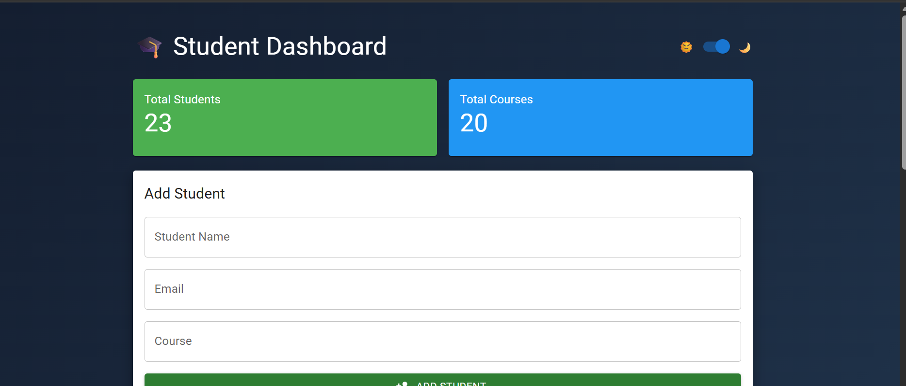
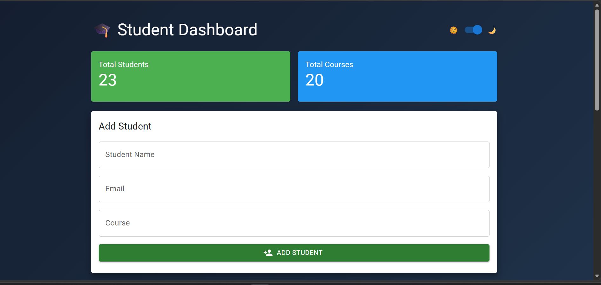
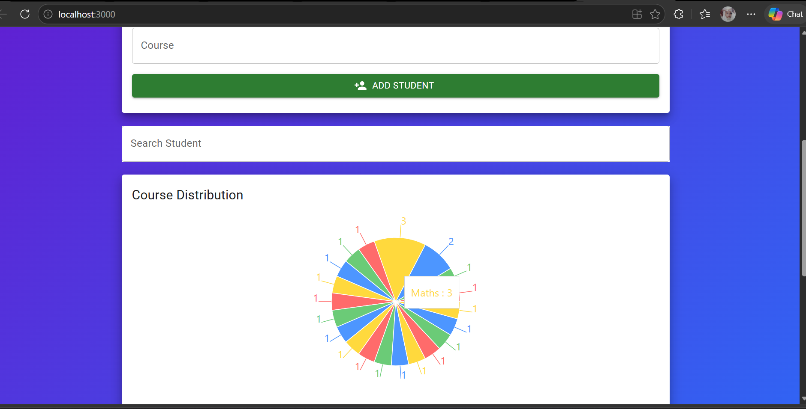
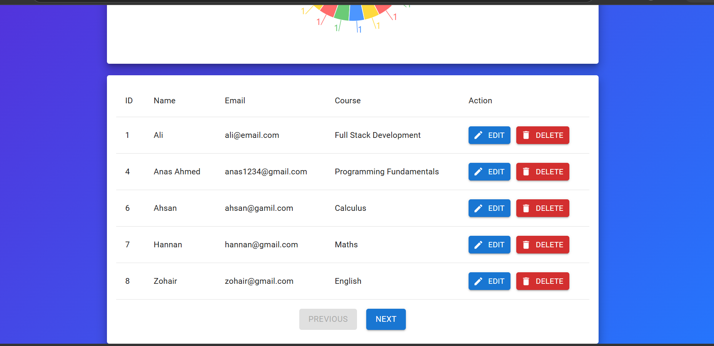
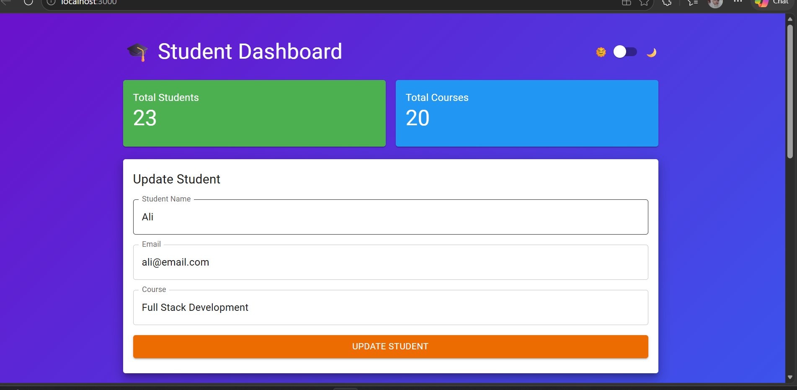
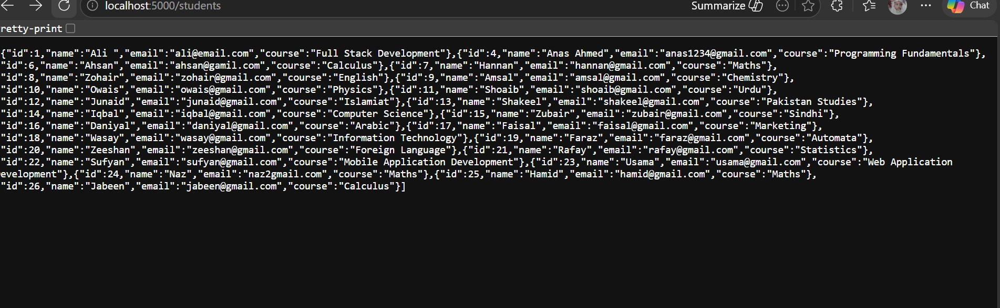
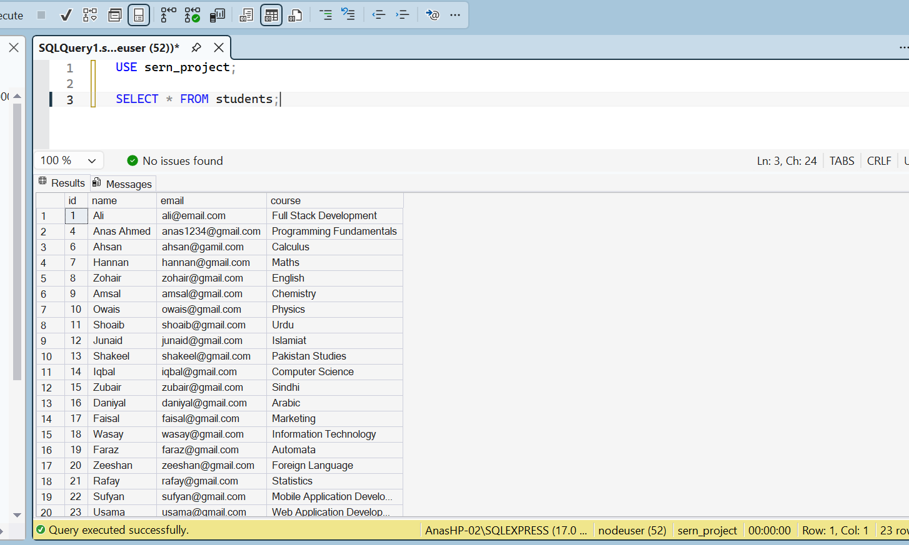

<div align="center">

# 🎓 Student Management System

### *Full-Stack SERN Application — SQL Server · Express · React · Node.js*

[](https://react.dev/)
[](https://nodejs.org/)
[](https://expressjs.com/)
[](https://www.microsoft.com/sql-server)
[](https://mui.com/)
[](https://www.framer.com/motion/)
[](https://sernstdmanagement.netlify.app/)

A full-stack **Student Management System** built with the **SERN** stack (SQL Server, Express, React, Node.js). It provides a clean and interactive dashboard to add, view, update, delete, and search student records — backed by a RESTful API and a Microsoft SQL Server database, with animated UI transitions and a live Course Distribution chart.

[🌐 Live Demo](https://sernstdmanagement.netlify.app/) &nbsp;·&nbsp; [📁 Repository](https://github.com/AnasQ2003/Student-Management-System) &nbsp;·&nbsp; [🐛 Report Bug](https://github.com/AnasQ2003/Student-Management-System/issues)

</div>

---

## ✨ Features

- **📊 Live Dashboard Summary** — Real-time counters for Total Students enrolled and Total Courses available, displayed on prominent color-coded cards.
- **➕ Add Student** — A form panel to register a new student by entering their name, email, and enrolled course. Records instantly reflect in the table after submission.
- **✏️ Edit Student** — Click the Edit button on any student row to pre-fill the form and update their details with a single click via the Update button.
- **🗑️ Delete Student** — Instantly remove a student record from the database with a confirmation-safe red Delete button per row.
- **🔍 Real-time Search** — Filter the student list dynamically by typing any part of the student name — no page reload required.
- **📈 Course Distribution Pie Chart** — An interactive, color-coded Recharts pie chart shows a live breakdown of students enrolled per course.
- **📄 Paginated Student Table** — Student records are displayed in a clean MUI data table, with Previous/Next pagination (5 records per page) for easy navigation.
- **🌙 Dark Mode Toggle** — A sleek sun/moon switch smoothly transitions the full dashboard between a vibrant purple/blue gradient (light) and a deep navy gradient (dark) theme.
- **⚡ Animated Transitions** — Page elements and table rows use Framer Motion for smooth fade-in and slide animations on load and update.
- **🔗 RESTful Backend API** — Full CRUD endpoints exposed via Express on port 5000, easily testable with a browser or Postman.

---

## 🛠️ Tech Stack

### Frontend
| Technology | Version | Purpose |
|---|---|---|
| **React** | v19 | Core UI component framework |
| **Material UI (MUI)** | v7 | Component library — tables, forms, cards, buttons |
| **Framer Motion** | v12 | Animated page transitions and row entrance effects |
| **Recharts** | v3 | Interactive Pie Chart for course enrollment statistics |
| **Axios** | v1 | HTTP client for API communication |

### Backend
| Technology | Version | Purpose |
|---|---|---|
| **Node.js** | v18+ | JavaScript server runtime |
| **Express** | v5 | Lightweight RESTful API framework |
| **mssql** | v12 | Microsoft SQL Server database driver for Node.js |
| **cors** | v2 | Cross-origin resource sharing middleware |

### Database
| Technology | Details |
|---|---|
| **Microsoft SQL Server** | SQL Server 2022 (Express or Developer Edition) |
| **Instance** | `localhost\SQLEXPRESS` |
| **Database Name** | `sern_project` |
| **Table** | `students` (id, name, email, course) |

---

## 🚀 Getting Started

### Prerequisites

Before you begin, ensure you have the following installed on your machine:

- **Node.js** v18.0.0 or higher → [Download](https://nodejs.org/)
- **Microsoft SQL Server** (Express or Developer edition) → [Download](https://www.microsoft.com/en-us/sql-server/sql-server-downloads)
- **SQL Server Management Studio (SSMS)** → [Download](https://learn.microsoft.com/en-us/sql/ssms/download-sql-server-management-studio-ssms)
- **Git** → [Download](https://git-scm.com/)

---

### 1. Clone the Repository

```bash
git clone https://github.com/AnasQ2003/Student-Management-System.git
cd Student-Management-System
```

---

### 2. Database Setup

Open **SQL Server Management Studio (SSMS)**, connect to your local `SQLEXPRESS` instance, and run the following SQL script to set up the database, user, and table:

```sql
-- Step 1: Create the database
CREATE DATABASE sern_project;
GO

-- Step 2: Create a SQL login for the app
CREATE LOGIN nodeuser WITH PASSWORD 
GO

-- Step 3: Connect the login to the database
USE sern_project;
GO
CREATE USER nodeuser FOR LOGIN;
GO
ALTER ROLE db_owner ADD MEMBER;
GO

-- Step 4: Create the students table
CREATE TABLE students (
    id    INT IDENTITY(1,1) PRIMARY KEY,
    name  NVARCHAR(255) NOT NULL,
    email NVARCHAR(255) NOT NULL,
    course NVARCHAR(255) NOT NULL
);
GO
```

> **Note:** Make sure SQL Server Authentication is enabled on your SQL instance. In SSMS, right-click the server → Properties → Security → select *SQL Server and Windows Authentication mode*.

---

### 3. Backend Setup

Navigate to the `server` directory and install dependencies:

```bash
cd server
npm install
```

The database connection is configured in `server/db.js`. The default config matches the credentials created above:

```js
const config = {
  user: "user",
  password: "123",
  server: "localhost",
  database: "----",
  options: {
    instanceName: "SQLEXPRESS",
    encrypt: false,
    trustServerCertificate: true
  }
};
```

Start the backend server:

```bash
npm start
```

The server will run on **http://localhost:5000**. You should see:

```
Connected to SQL Server successfully
Server running on port 5000
```

---

### 4. Frontend Setup

Open a **new terminal**, navigate to the `client` directory, and install dependencies:

```bash
cd client
npm install
```

Start the React development server:

```bash
npm start
```

Open your browser at **http://localhost:3000** to view the app.

---

## 🔌 API Reference

All endpoints are served from the Express backend at `http://localhost:5000`.

| Method | Endpoint | Description | Body |
|--------|----------|-------------|------|
| `GET` | `/` | Health check — confirms server is running | — |
| `GET` | `/students` | Fetch all student records | — |
| `POST` | `/students` | Add a new student | `{ name, email, course }` |
| `PUT` | `/students/:id` | Update a student's details by ID | `{ name, email, course }` |
| `DELETE` | `/students/:id` | Delete a student record by ID | — |

### Example Requests

**Get all students:**
```bash
curl http://localhost:5000/students
```

**Add a new student:**
```bash
curl -X POST http://localhost:5000/students \
  -H "Content-Type: application/json" \
  -d '{"name": "Anas Ahmed", "email": "anas@gmail.com", "course": "Full Stack Development"}'
```

**Update a student (ID = 1):**
```bash
curl -X PUT http://localhost:5000/students/1 \
  -H "Content-Type: application/json" \
  -d '{"name": "Anas Q", "email": "anasq@gmail.com", "course": "React Development"}'
```

**Delete a student (ID = 1):**
```bash
curl -X DELETE http://localhost:5000/students/1
```

---

## 📁 Project Structure

```
Student-Management-System/
│
├── client/                         # React frontend (Create React App)
│   ├── public/
│   │   └── index.html              # HTML document wrapper
│   ├── src/
│   │   ├── App.js                  # Main application component (all UI + logic)
│   │   ├── App.css                 # Global app styles
│   │   ├── index.js                # React DOM entry point
│   │   └── index.css               # Base CSS reset
│   └── package.json                # Frontend dependencies
│
├── server/                         # Node.js + Express backend
│   ├── db.js                       # SQL Server connection config
│   ├── server.js                   # Express app entry, all CRUD routes
│   └── package.json                # Backend dependencies
│
├── m1.png → m7.png                 # Application screenshots
├── .gitignore
└── README.md
```

---

## 🗄️ Database Schema

### Students Table

```sql
CREATE TABLE students (
    id     INT IDENTITY(1,1) PRIMARY KEY,  -- Auto-increment unique ID
    name   NVARCHAR(255) NOT NULL,          -- Full name of the student
    email  NVARCHAR(255) NOT NULL,          -- Student email address
    course NVARCHAR(255) NOT NULL           -- Enrolled course name
);
```

### Sample Data

| id | name | email | course |
|----|------|-------|--------|
| 1 | Ali | ali@email.com | Full Stack Development |
| 4 | Anas Ahmed | anas1234@gmail.com | Programming Fundamentals |
| 6 | Ahsan | ahsan@gamil.com | Calculus |
| 7 | Hannan | hannan@gmail.com | Maths |
| 8 | Zohair | zohair@gmail.com | English |

---

## 📷 Screenshots Gallery

A complete visual walkthrough of the Student Management System interface, showcasing both light and dark mode themes, the full CRUD workflow, and the backend API.

### 🌙 Dark Mode Dashboard

<table>
  <tr>
    <td><br/><sub>Dashboard — Summary Cards & Add Student Form (Dark Mode)</sub></td>
    <td><br/><sub>Dashboard — Add Student Form with Button (Dark Mode)</sub></td>
  </tr>
</table>

### ☀️ Light Mode — Pie Chart & Student Table

<table>
  <tr>
    <td><br/><sub>Course Distribution Pie Chart with Search Bar (Light Mode)</sub></td>
    <td><br/><sub>Paginated Student Records Table with Edit & Delete Actions</sub></td>
  </tr>
</table>

### ✏️ Update Student Form

<table>
  <tr>
    <td colspan="2" align="center">
      <br/><sub>Update Student — Pre-filled Form with Existing Student Data</sub>
    </td>
  </tr>
</table>

### 🔗 Backend API & Database

<table>
  <tr>
    <td><br/><sub>Express REST API Response — GET /students (JSON Output)</sub></td>
    <td><br/><sub>SQL Server Management Studio — Students Table Query Results</sub></td>
  </tr>
</table>

---

## 🌐 Live Demo

The frontend is deployed on **Netlify**:

🔗 **[https://sernstdmanagement.netlify.app/](https://sernstdmanagement.netlify.app/)**

> **Note:** The live demo connects to a hosted backend. For full CRUD functionality with a local database, follow the [Getting Started](#-getting-started) guide above to run the project locally.

---

## 🤝 Contributing

Contributions, bug reports, and feature suggestions are welcome!

1. Fork the repository
2. Create a new feature branch: `git checkout -b feature/your-feature-name`
3. Commit your changes: `git commit -m "feat: add your feature"`
4. Push to the branch: `git push origin feature/your-feature-name`
5. Open a Pull Request

---

## 📜 License

© 2026 **Anas Ahmed Qureshi**. All Rights Reserved.

---

<div align="center">

Built with ❤️ using **SQL Server · Express · React · Node.js**

⭐ If you found this useful, please consider giving the repo a star!

</div>
